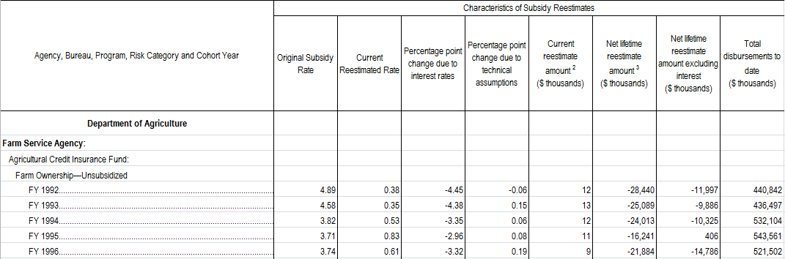

```{r include=FALSE}

knitr::opts_chunk$set(out.width="90%", fig.height=6) 

knitr::opts_chunk$set(warning = FALSE)

knitr::opts_chunk$set(echo = FALSE)

# Load data, packages, and custom scripts
load("reestimate_rates.RData")

require(plotly); require(dplyr); require(htmlTable)

```


```{r}
# Clean anomalies in data

# Education has essentially duplicate entries for direct student loans (only weighted avg of all programs
# is reported in supplement for years after 2008) - anything 2008 and prior will double count direct
# student loans and FFEL Guarantees

# Ginnie Mae guarantees should also be excluded

edu_progs <- c("SUBSIDIZED STAFFORD", "UNSUBSIDIZED STAFFORD", "PLUS", "CONSOLIDATED")
gnma <- "GUARANTEES OF MORTGAGE BACKED SECURITIES"

prog_filter <- c(edu_progs, gnma)

re <- reestimate_rates %>% filter(!prog %in% prog_filter) %>%
  mutate(rate_chg = cur_sr - orig_sr)

re_w_gnma <- reestimate_rates %>% filter(!prog %in% edu_progs) %>%
  mutate(rate_chg = cur_sr - orig_sr)

lastyear <- re_w_gnma %>% filter(fy == max(fy))

```

```{r}

# Functions for plotting

# Line Plot

plot_lines <- function(df, metric, grp_col, plt_title, y_title) {
  
  df$wrap <- sapply(df[[grp_col]], FUN = function(x) {paste(strwrap(x, width = 25), collapse = "<br>")})
  
  if (metric %in% c('life_disb', 'pct_chg')) {
    
    df <- df %>% filter(fy > 2005)
    
  }
  
  plot_ly(data = df, x = ~fy, y = ~get(metric), color = ~wrap, 
        type = 'scatter', mode = 'lines+markers', colors = "Paired",
        text = ~paste('Program', wrap,
                      '<br>Agency:', h1,
                      '<br>Fiscal Year:', fy),
        hoverinfo = 'y+text',
        line = list(width = 3)) %>%
  layout(title = paste(plt_title),
         titlefont = list(size = 16),
         yaxis = list(showgrid = FALSE, title = y_title),
         xaxis = list(showgrid = FALSE, title = 'Budget Year')
  )
  
}

# Horizontal Bar Chart

compare_bars <- function(df, lab, metric, plt_title, margin, ann_placement = 'right') {
  
  df <- df %>% arrange_(metric)
  
  df$wrap <- sapply(df[[lab]], FUN = function(x) {paste(strwrap(x, width = 25), collapse = "<br>")})
  
  lab_factors <- factor(df[['wrap']], levels = df[['wrap']])

  compare_lab <- df %>% mutate(label = lab_factors) 
  
  if (ann_placement == 'right') {
  
  a <- list(
  text = paste('Cummulative Total:', get_billions(sum(df[[metric]]))),
  showarrow = FALSE,
  font = list(color = '#7D7D7D'),
  y = 1,
  x = max(df[[metric]]),
  yanchor = 'top',
  xanchor = 'right'
  )
  
  } else if (ann_placement == 'left') {
    
  a <- list(
  text = paste('Cummulative Total:', get_billions(sum(df[[metric]]))),
  showarrow = FALSE,
  font = list(color = '#7D7D7D'),
  y = nrow(df)/2,
  x = min(df[[metric]]),
  yanchor = 'top',
  xanchor = 'left'
  )
    
  }
  
  plot_ly(compare_lab,
                  y = ~label,
                  x = ~get(metric),
                  type = 'bar',
                  marker = list(color = 'rgba(55, 128, 191, 0.7)',
                                line = list(color = 'rgba(55, 128, 191, 0.9)',
                                            width = 1.5))) %>%
            layout(title = plt_title,
                   annotations = list(a),
                   xaxis = list(title = ""),
                   yaxis = list(title = ""),
                   margin = list(l = margin))

}

# Formatting Large $ Values

get_millions <- function(x) {
  
  if (is.na(x)) {
    
    NA
  
  } else {
    
    paste0('$', formatC(x/1e6, format = 'f', big.mark = ',', digits = 2), ' M')
    
  } 
  
}

get_billions <- function(x) {
  
  if (is.na(x)) {
    
    NA
  
  } else {
    
    paste0('$', formatC(x/1e9, format = 'f', big.mark = ',', digits = 2), ' B')
    
  } 
  
}


```


##Background

The U.S. Government's portfolio of loans extended through Federal credit programs has experienced rapid growth over the last twenty years. With a balance sheet of active loans well over $3 Trillion, the U.S. Government manages a loan portfolio much larger than any bank. At FI Consulting we have extensive domain expertise in Credit Reform, the budgeting system employed to measure the cost of Federal credit programs. In this post we will take a closer look into this massive portfolio of loans through the lens of Credit Reform,  using data published annually in the Federal Credit Supplement to the President's Budget.  

This post is also accompanied by an application to interactively explore the Federal Credit Supplement data for all agencies and credit programs going back to budget year 1998.  Click the 'Interactive' button at the top of the page to view the application.  Data utilized in this analysis along with the interactive application is as of the 2018 budget year Federal Credit Supplement.

In the next section, we will discuss what Credit Reform is.  In Section 3 we discuss the growth of Federal Credit programs by agency, highlighting housing and student loan programs.  In Section 4 we discuss cost estimates and how the subsidy cost of a program changes over time.  Lastly we will take a deeper dive into subsidy cost estimates for Treasury Department programs established in response to the financial crisis.

#### What is Credit Reform

The Federal Credit Reform Act of 1990 (FCRA) established how the budgetary cost of Federal Credit programs is measured.  Under FCRA, the cost of a direct or guaranteed loan -- also referred to as the subsidy cost -- is equal to the present value of net cash flows over the life of the loan. Agencies estimate the subsidy cost of a cohort of loans and this estimate will dictate the amount of money that the program can lend.  The following example comes from Thomas Stanton's [Primer on Credit Reform](http://www.coffi.org/pubs/Primer%20on%20Credit%20Reform%20by%20Stanton.pdf): 

"If the estimated present value of a direct loan’s cash outflows equals \$100 and the present value of its inflows equals \$90, its subsidy cost is $10 and its subsidy rate is 10 percent. If an agency proposed to make \$2,000 of these loans, it would seek an appropriation of 10 percent of the desired face value, or \$200." 

Agencies re-estimate subsidy costs on an annual basis in order to keep financing accounts in a break-even position.  These re-estimates are provided through permanent indefinite budget authority under FCRA and do not require congressional action or count against an agency’s discretionary funds allocation.  In other words as loan cohorts age  and repay or default,  agencies re-estimate the credit subsidy cost and accordingly allocate funds to keep budget accounts balanced. 

Subsidy rate and re-estimate amount details are published in the Federal Credit Supplement (FCS) to the President's Budget on an annual basis.  This analysis utilizes 20 years of data published in the supplement for over 2,250 Federal Credit program cohorts -- for details on data preparation check out the appendix at the end of this post.  

For more detailed background information on the budgeting process for Federal Credit programs Douglas Elliot's [Budgeting for Credit Programs: A Primer](http://www.coffi.org/pubs/Budgeting%20Primer.pdf) is another good resource.

***

##Data Analysis

###Exploring The 2018 Budget Year FCS

The following tables and plots provide a current snapshot of the Federal Credit landscape as of the most recently published [Federal Credit Supplement](https://www.gpo.gov/fdsys/pkg/BUDGET-2018-FCS/pdf/BUDGET-2018-FCS.pdf). This data is for budget year 2018 and was made public in May 2017. We will be taking a closer look at data contained in tables 7 and 8 of the FCS which detail lifetime disbursement amounts, current subsidy rates, and re-estimate amounts for all active Federal Credit programs.

####Lifetime Disbursements

Outstanding principal balances are not available in the FCS, however disbursements serve as a good proxy for which agencies have the largest portfolios of Federal Credit programs.  The table below shows lifetime disbursements by agency along with the change from the prior year's FCS. Three agencies have programs with lifetime disbursements greater than \$1 Trillion, with the Department of Housing and Urban Development (HUD) standing out having disbursed or guaranteed over $3.5 Trillion of loans since 1992 (fiscal year 1992 was the first year that agencies implemented credit reform accounting). 

<center>

```{r}

# Get reestimate and disbursement data by agency

lre <- re %>% group_by(fy, h1) %>%
  summarise(life_re = sum(life_re * 1000, na.rm = T), 
            life_disb = sum(disb * 1000, na.rm = T),
            curr_re = sum(cur_re * 1000, na.rm = T),
            program_cnt = n_distinct(prog)) %>% 
  ungroup() %>% filter(fy > 2005)

# Get YOY changes as of most recent Budget Year

disb_changes <- lre %>% filter(fy >= max(fy) - 1) %>% group_by(h1) %>%
  mutate(disb_chg = life_disb/lag(life_disb) - 1) %>% ungroup() %>% arrange(desc(life_disb))

disb_total <- disb_changes %>% group_by(fy) %>% summarise(program_cnt = sum(program_cnt),
                                                          life_disb = sum(life_disb, na.rm = T)) %>%
  mutate(disb_chg = life_disb/lag(life_disb) - 1, h1 = 'Total')

disb_changes <- bind_rows(disb_changes, disb_total)

# Join and add formatting for table

disb_max <- disb_changes %>% filter(fy == max(fy)) %>% select(h1, program_cnt, life_disb, disb_chg) %>% 
  mutate(disb_chg = paste(format(round(disb_chg * 100, 2), nsmall = 2), '%'),
         life_disb = sapply(life_disb, get_billions)) %>%
  select(Agency = h1, Programs = program_cnt, `Lifetime Disbursements` = life_disb, `YoY Change (%)` = disb_chg)


htmlTable(disb_max, 
          rnames = FALSE, 
          col.rgroup = c("none", "#F7F7F7"),
          align = 'lrr',
          align.header = 'lcr',
          caption="",
          css.cell = 'padding: 3px 40px 3px;')


```

</center>

* Loan cohorts that have closed or have reached maturity no longer require subsidy re-estimates and therefore are last reported in the Federal Credit Supplement in the year the cohort is closed.  This explains why some agencies have negative year-over-year changes in disbursements. 
* The Government National Mortgage Association's (Ginnie Mae) guarantees of mortgage backed securities were removed from lifetime disbursement totals to avoid double-counting. Re-estimate data for Ginnie Mae (part of HUD) MBS guarantees is included in the FCS and can be explored in the interactive app.

***

The Federal Credit Supplement shows that the majority of loan disbursements are concentrated to a handful of massive programs.  The table below shows the top five Federal Credit programs by lifetime disbursements as of budget year 2018.  The top two programs are related to housing, numbers four and five are education programs, and fifth is the Export-Import Bank's Guarantee and Insurance program.  Most of HUD's credit portfolio is comprised of the FHA Mutual Mortgage Insurance (MMI) Fund - over \$3.3 trillion of lifetime disbursements.  

<center>

```{r}

prog_list <- re %>% group_by(fy, h1, type, prog) %>% 
  summarise(life_disb = sum(disb * 1000, na.rm = T)) %>%
  ungroup() %>% group_by(prog, h1) %>% arrange(prog, h1, fy) %>% 
  mutate(disb_chg = life_disb/lag(life_disb) - 1,
         prog_type = ifelse(type == 'DL', 'Direct', 'Guarantee')) %>% ungroup()


prog_table <- prog_list %>% filter(fy == max(fy)) %>% arrange(desc(life_disb)) %>%
  mutate(life_disb = sapply(life_disb, get_billions),
         disb_chg = paste(format(round(disb_chg * 100, 2), nsmall = 2), '%')) %>%
  select(Agency = h1, Program = prog, Type = prog_type, `Lifetime Disbursements` = life_disb, 
         `YoY Change (%)` = disb_chg)
  

htmlTable(head(prog_table, 5), 
          rnames = FALSE, 
          col.rgroup = c("none", "#F7F7F7"),
          align = 'lllrr',
          align.header = 'c',
          css.cell = 'padding: 3px 35px 3px;')


```

</center>

***

```{r}

top_list <- prog_list %>% filter(fy == 2018) %>% 
  mutate(rank = rank(-life_disb)) %>% 
  filter(rank <= 5) %>% .[['prog']]

top_five <- data.frame()
for (p in top_list) {
  
  a <- prog_list %>% filter(prog == p) %>%
    mutate(base_amt = .[grep('2006', .$fy),][['life_disb']]) %>%
    mutate(pct_chg = (life_disb/base_amt - 1) * 100)
  
  top_five <- rbind(a, top_five)
  
}


```

The plot below displays how disbursements have increased for these top programs over the last decade.  The lines show the change in lifetime disbursements relative to what was reported as of 2006.  The two housing programs have grown steadily following the housing downturn with total disbursements having increased about 200% for each program. The Federal Direct Student loan program on the other hand has sharply grown to over 700% of what was reported as of budget year 2006.  Some of this volume appears to have been shifted from the FFEL (Federal Family Education Loan) Guarantee program as loans are no longer originated under this program, however older cohorts still undergo subsidy re-estimates on a yearly basis.

<center>
```{r}

plot_lines(top_five, 'pct_chg', 'prog', 'Lifetime Disbursement Growth - Top Five Programs', 
           'Percent Change Relative 2006 Disbursements')

```
</center>

#### Subsidy Rate Re-Estimates

As mentioned in the introduction, the subsidy cost of each program cohort is estimated at the beginning of the cohort’s life and then adjusted as new information becomes available.  From the FCS we have the original subsidy rate forecast as well as the subsidy rate re-estimate as of each subsequent budget year.  By comparing the original subsidy rate forecast with the re-estimated subsidy rate we can measure the accuracy of subsidy forecasts for all loan cohorts.

The following plot shows the distribution of changes in subsidy estimates for all loan cohorts published in the most recent FCS.  Each dot represents a cohort of loans, the x coordinate is the original subsidy rate and the y coordinate is the most recent subsidy rate re-estimate.  Any point that lands on the dashed red line indicates that the current subsidy rate is equal to the original forecast.  Any point that falls below the dotted line has had a decrease in subsidy rate (downward re-estimate) and any point above has had a subsidy rate increase (upward re-estimate).  As of the most recent fiscal year, approximately 42% of all active cohorts have had a subsidy rate increase since origination.   

<center>
```{r}

#plot_ly(data = lastyear, x = ~orig_sr, y = ~cur_sr, type = 'scatter', mode = 'markers')

min_point <- min(lastyear$orig_sr, na.rm = TRUE) - 1
max_point <- max(lastyear$orig_sr, na.rm = TRUE) + 1

a <- list(
  text = 'Subsidy Increases',
  showarrow = FALSE,
  y = max_point,
  x = min_point,
  yanchor = 'top',
  xanchor = 'left'
  )

b <- list(
  text = 'Subsidy Decreases',
  showarrow = FALSE,
  y = min_point,
  x = max_point,
  yanchor = 'bottom',
  xanchor = 'right'
  )


plot_ly(lastyear, x = ~orig_sr, y = ~cur_sr, 
                type = 'scatter', mode = 'markers', hoverinfo = 'text',
                text = ~paste('Cohort:', co_yr, '</br> Program:', prog,
                              '</br> Original Rate:', round(orig_sr, 2),
                              '</br> Current Rate:', round(cur_sr, 2)),
                marker = list(size = 8,
                              opacity = .5,
                              color = c("#7A6CF7"),
                              line = list(color = '#0A0B2E',
                                          width = 2))) %>%
            layout(title = paste('Subsidy Rate Distribution By Program Cohort'),
                   titlefont = list(size = 16),
                   xaxis = list(showgrid = FALSE, title = 'Original Subsidy Rate'),
                   yaxis = list(showgrid = FALSE, title = 'Current Subsidy Rate'),
                   annotations = list(a, b),
                   #showlegend = FALSE,
                   shapes = list(
                     type = 'line',
                     layer = 'above',
                     line = list(color = "#800505", dash = "longdash", width = 3),
                     x0 = min_point,
                     y0 = min_point,
                     x1 = max_point,
                     y1 = max_point
                   )
                   )

```
</center>
***

Most points on the above scatter plot are clustered around the red dashed line which represents a perfect subsidy forecast, however there are several outliers that have had dramatic increases or decreases in subsidy rate.  To further investigate the distribution and directionality of subsidy rate re-estimates for specific populations within the FCS check out the application included with this post. Users can view this scatter plot by agency or program and also drill down to the cohort level to see the change in subsidy rates due to interest and technical updates.

***

#### Re-Estimate Amounts

Current re-estimate amounts represent the change in subsidy cost in dollars as of the budget year and lifetime re-estimates are equal to the cumulative sum of all re-estimates during cohort life.  We saw in the prior scatter plot that in aggregate subsidy forecasts are fairly accurate with some loan cohorts costing more or less than what was forecasted at the point of origination, but what is the net effect in dollars?  

Taking a snapshot of the 2018 budget year FCS, we'll first look at current re-estimate amounts.  We can see that both the Department of Education and HUD had large upward reestimates totaling approximately \$55B.  Cumualtive re-estimates in the last fiscal year across all agencies equal \$45.36B.   

<center>
```{r}

lre_ <- re_w_gnma %>% group_by(fy, h1) %>%
  summarise(life_re = sum(life_re * 1000, na.rm = T), 
            life_disb = sum(disb * 1000, na.rm = T),
            curr_re = sum(cur_re * 1000, na.rm = T),
            program_cnt = n_distinct(prog)) %>% 
  ungroup() %>% filter(fy > 2005)

lre_ly <- lre_ %>% filter(fy == max(fy))

compare_bars(lre_ly, 'h1', 'curr_re', 'Current Re-estimates by Agency - 2018 FCS', 160)

```
</center>

In reviewing agency lifetime re-estimates we see that active Treasury Department programs have experienced \$100B in downward lifetime re-estimates. The Department of Housing and Urban Development on the other hand has undergone over \$80B in upward re-estimates, meaning that in aggregate subsidy cost forecasts have been revised upward for active HUD programs.  While we did see a fairly large net upward re-estimate in the most recent fiscal year, total net lifetime reestimates remain negative at -\$20.45B for all active Federal Credit programs.  To view historical trends in reestimate amounts by agency and program visit the application. 

<center>
```{r}

compare_bars(lre_ly, 'h1', 'life_re', 'Lifetime Re-estimates by Agency - 2018 FCS', 160)
```
</center>

***

###Treasury Department Program Review

We just saw that Treasury Department programs have ended up costing \$100B less than initially forecasted, now we'll take a closer look at the programs behind these downward re-estimates and visualize some notable trends.  The Treasury Department greatly expanded its loan portfolio in response to the financial crisis in 2009 through a number of targeted programs, many created using capital allocated under the Troubled Asset Relief Program (TARP).  Prior to 2009, lifetime disbursements for Treasury programs reported in the FCS totaled just over \$3B - as of 2009 that number shot up to \$860B, peaking at nearly $930B in 2010.  

Many of these programs have ended up costing far less than initially forecasted.  One extreme case is the Treasury's \$100M [Term Asset Backed Securities Loan Facility](https://www.treasury.gov/initiatives/financial-stability/TARP-Programs/credit-market-programs/talf/Pages/default.aspx) (TALF) deployed in 2009.  This program had an original subsidy rate of -104% and was last reported in the budget year 2017 FCS as having a subsidy rate of -605%.   The negative subsidy rate implies that lifetime cash inflows exceed outflows - in this case by a factor of six - therefore the cost of the program is negative. The following bubble plot shows the distribution of changes in subsidy rate weighted by cohort size for all Treasury program cohorts created in 2009 or later.  

<center>
```{r}

# remove any programs that have cohorts prior to 2008

treasury <- re %>% filter(h1 == 'Treasury')

old_prog <- treasury %>% filter(fy < 2009) %>% distinct(prog) %>% .[['prog']]

new_prog <- treasury %>% filter(!prog %in% old_prog) %>% 
  mutate(h2 = ifelse(h2 == 'DEPARTMENTAL OFFICES', h3, h2))

# Get subsidy rate and re-estimate values as of last year where current rate is not null.  

treasury_programs <- data.frame()
for(p in unique(new_prog$prog)) {
  
  df <- new_prog %>% filter(prog == p)
  
  for (coh in unique(df$co_yr)) {
    
    d1 <- df %>% filter(co_yr == coh)
    
  # Find max year where cur_sr was not null
  
    fy_list <- d1[!is.na(d1$cur_sr) & !is.na(d1$life_re),][['fy']]
    
    if (length(fy_list) == 0) {
      max_fy = max(d1$fy)
    } else {
      max_fy = max(fy_list)
    }
    
    new_df <- data.frame(prog = p, co_yr = coh, fy = max_fy)
    
    treasury_programs  <- rbind(treasury_programs, new_df)
    
  }
  
}

treasury_programs <- treasury_programs %>% left_join(new_prog, by = c("prog", "co_yr", "fy")) %>%
  mutate(size = sqrt(1/min(disb, na.rm = T) * disb),
         wrapped_label = sapply(h2, FUN = function(x) {paste(strwrap(x, width = 25), collapse = "<br>")}),
         wrapped_prog = sapply(prog, FUN = function(x) {paste(strwrap(x, width = 25), collapse = "<br>")})) 

min_point <- -90
max_point <- 90

at1 <- list(
  text = 'Subsidy Increases',
  showarrow = FALSE,
  y = max_point - 10,
  x = -1*max_point,
  yanchor = 'top',
  xanchor = 'left'
  )

at2 <- list(
  text = 'Subsidy Decreases',
  showarrow = FALSE,
  y = min_point,
  x = max_point,
  yanchor = 'bottom',
  xanchor = 'right'
  )

at3 <- list(
  text = '** TALF Outlier Omitted',
  font = list(color = '#7D7D7D'),
  y = min_point,
  x = -60,
  showarrow = FALSE
  
)

plot_ly(treasury_programs %>% filter(prog != 'TERM ASSET BACKED SECURITIES LOAN FACILITY'),  
        x = ~orig_sr, y = ~cur_sr, color = ~wrapped_label, size = ~size, colors = 'Paired', 
        hoverinfo = 'text',
        text = ~paste('Cohort:', co_yr, '</br> Program:', wrapped_prog,
                      '</br> Original Rate:', round(orig_sr, 2),
                      '</br> Current Rate:', round(cur_sr, 2)),
        type = 'scatter', mode = 'markers', sizes = c(min(treasury_programs$size, na.rm = T), 
                                                      max(treasury_programs$size, na.rm = T)),
        marker = list(symbol = 'circle', sizemode = 'diameter',
                      line = list(width = 2, color = '#000000'))) %>%
  layout(title = 'Treasury Subsidy Rate Distribution',
    shapes = list(
                     type = 'line',
                     layer = 'above',
                     line = list(color = "#800505", dash = "longdash", width = 3),
                     x0 = min_point,
                     y0 = min_point,
                     x1 = max_point,
                     y1 = max_point
                   ),
         annotations = list(at1, at2, at3),
         xaxis = list(title = 'Original Subsidy Rate', showgrid = FALSE),
         yaxis = list(title = 'Current Subsidy Rate', showgrid = FALSE)
         )

pct_neg <- treasury_programs %>% 
  summarise(pct_neg = round(sum(cur_sr <= orig_sr, na.rm = T)/sum(!is.na(cur_sr)), 3),
            total_re = sum(life_re * 1000, na.rm = T)) %>%
  mutate(pct = paste0(pct_neg * 100, '%'),
         re = paste0('$', total_re))

treasury_programs <- treasury_programs %>% 
  mutate(cost = (disb * 1000)*(cur_sr/100))
  

```
</center>

The current and original subsidy rate values are as of the cohort's most recent entry in the Federal Credit Supplement (for instance if the cohort was last recorded in the FCS in 2015, the current subsidy rate equals the value in 2015). There are several high-profile programs such as the [Automotive Industry Financing Program](https://www.treasury.gov/initiatives/financial-stability/TARP-Programs/automotive-programs/Pages/default.aspx) and [AIG Investments](https://www.treasury.gov/initiatives/financial-stability/TARP-Programs/aig/Pages/default.aspx) program that experienced a decrease in subsidy forecast.  In total `r pct_neg[['pct']]` of Treasury cohort subsidy rates have declined since origination. 

***

####Treasury Re-estimates

Lifetime re-estimate amounts total approximately -\$191B for Treasury programs (including currently inactive programs) created after 2008.  TARP programs were the major drivers behind the downward re-estimates. Some large programs with high initial subsidy cost estimates like the \$204B 2009 cohort of the TARP [Capital Purchase Program](https://www.treasury.gov/initiatives/financial-stability/TARP-Programs/bank-investment-programs/cap/Pages/default.aspx) (original subsidy rate of 27%) ended up being profitable for the Treasury department (current subsidy rate of -3.46%).  

<center>
```{r}

# Bar chart of lifetime re-estimate for each h2

bar_data <- treasury_programs %>% group_by(h2) %>%
  summarise(life_re = sum(life_re * 1000, na.rm = T),
            life_disb = sum(disb * 1000, na.rm = T))

compare_bars(bar_data, 'h2', 'life_re', 'Lifetime Re-estimates - Treasury Programs', 200, 'left')

#compare_bars(bar_data, 'h2', 'life_disb', 'Lifetime Disbursements - Treasury Programs', 200, 'right')

```
</center>
***


## Conclusions

The U.S. Government's massive portfolio of Federal Credit programs is complex and diverse.  We've seen that there has been considerable growth in agency portfolios over the last decade, especially in response to the financial crisis beginning in 2008.  Federal Credit programs are intended to be tools to support specific social and public policy objectives.  Following the downturn in the economy, specifically in housing, the scope of many programs clearly grew as private credit markets shrunk and Federal direct loans and guarantees filled some of this void. For some of these high profile programs like TARP, subsidy cost estimates ended up well below what was initially forecasted, however the Deparment of Housing and Urban Development's programs have experienced upward cost re-estimates totaling over \$80B.  We've also seen that of the top programs by disbursement volume, growth in Federal Direct Student loans has far outpaced other top programs. Monitoring the accuracy of subsidy estimates will be notable for Department of Education loans as this portfolio grows. 

This analysis scratches the surface of the budgeting process for these programs and [debate over its effectiveness](http://www.ficonsulting.com/fair-value-for-federal-credit-programs-start-with-disclosure/), however the application accompanying this post allows readers to further explore the Federal Credit Supplement data.  

***

## Appendix - Data Prep

The Government Publishing Office makes available for download historic Federal Credit Supplements in Excel spreadsheets dating back to budget year 1998.  This analysis uses data from the 20 years worth of available data in these spreadsheets, specifically from tables 7 & 8 of the supplement.  These tables contain annual subsidy rate forecasts and re-estimates ($) for all Federal Credit program cohorts.  The data was extracted or 'scraped' from the FCS Excel tables using R and formatted to analyze historical trends. 

####Header Formatting

The image below shows an example of how the re-estimate tables of the Federal Credit Supplement are formatted.

Because agency, bureau, program and cohort year values are all contained in one column in the supplement, data wrangling is necessary to extract the text from each row and reshape the table into a format more conducive to performing analysis.  

<center>

{ width=90% }

</center>

Post data wrangling the re-estimate data from the above example is organized like so:

<center>

```{r message=FALSE}

prep_ex <-re %>% filter(fy == 2017 & prog == 'FARM OWNERSHIP' & type == 'LG')

data_prep <- prep_ex %>% 
  select(Year = fy, Cohort = co_yr, Agency = h1, Header.1 = h2, Header.2 = h3, 
  Program = prog, Original.Rate = orig_sr, Current.Rate = cur_sr)

htmlTable(head(data_prep, n = 5), 
          rnames = FALSE, 
          col.rgroup = c("none", "#F7F7F7"),
          align = 'llllllrr',
          align.header = 'cccccccr',
          css.cell = 'padding: 3px 30px 3px;')

```
</center>

***

#### Program Naming

In addition program naming conventions change over the years in the FCS. For instance the Department of Agriculture’s water and waste disposal loan guarantee program has the following name formatting in the 20 years of federal credit supplements: 

* Guaranteed Water and Waste Disposal Loans 
* Water and Waste Disposal Guaranteed Loans
* Water and Waste Disposal Loan Guarantees  

All program names were standardized to compare re-estimate results from one year to the next.   

***

